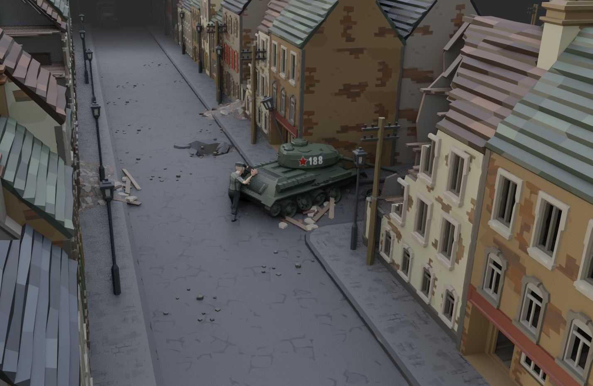
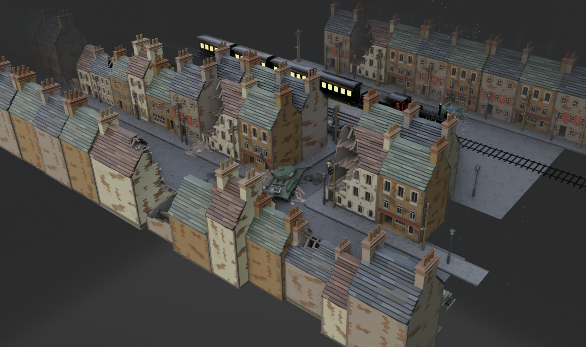
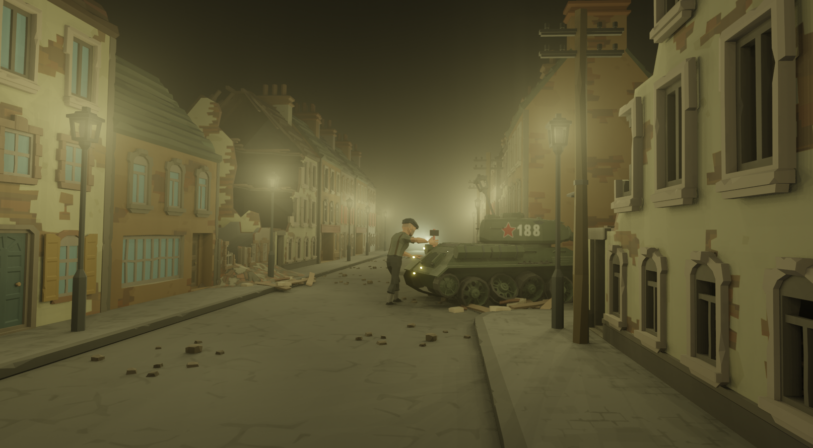
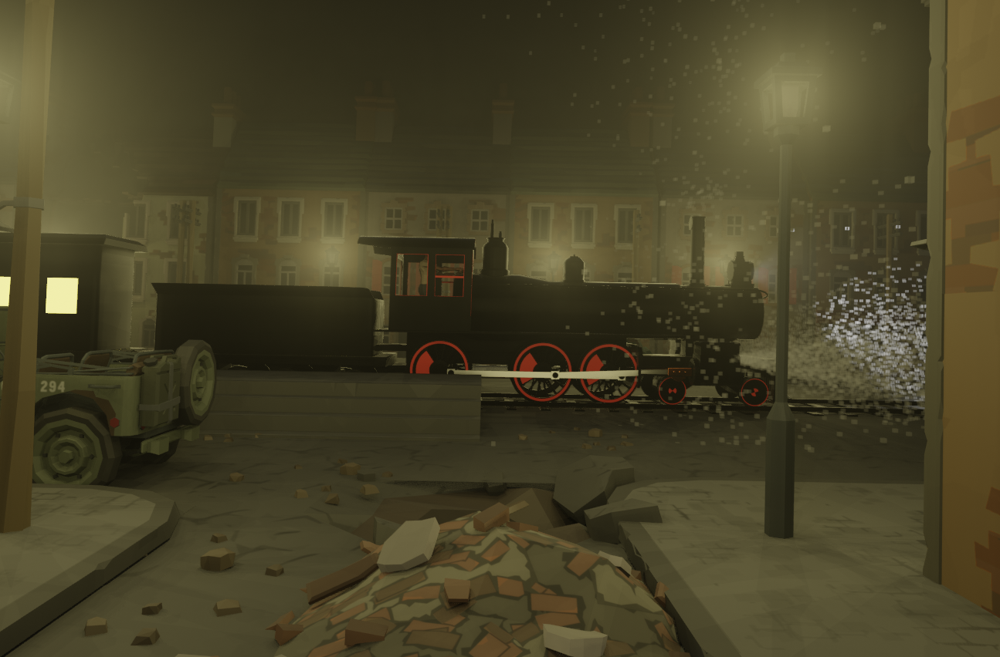
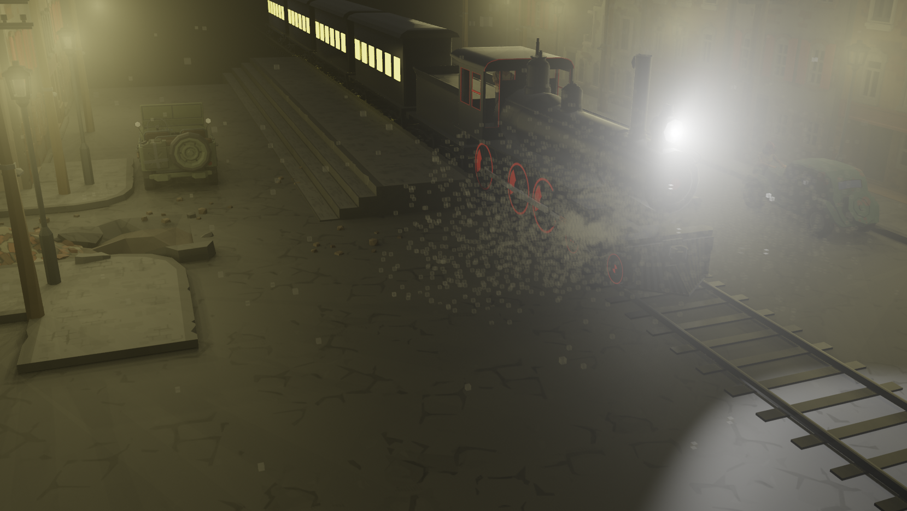

# 🌅 **«Домой» — катсцена с хорошей концовкой**  
### *Final Cutscene for the War-Themed Game*  
**Blender • EEVEE Render Engine • Cinematic Storytelling**

🎥 **Посмотреть катсцену в высоком качестве**:  
[▶️ Скачать/просмотреть видео (MP4, 1080p)](https://github.com/RedShiftStudio/WarGame-Catscene-City/releases/tag/v1)

> *«После всего, что он пережил… дом остался тем местом, куда можно вернуться»*  
— финальная строка сценария
  
  
  

---

## 🎬 О проекте  
Эта катсцена — **эмоциональная кульминация** повествования в игре о войне. В отличие от трагичных или неоднозначных финалов, здесь — **надежда, исцеление и возвращение к жизни**. Главный герой, прошедший через ад боя, разлуки и потерь, наконец шагает по родной дороге. Дом ждёт. Солнце садится. Мир дышит.

Сцена создана **полностью в Blender** с использованием рендер-движка **EEVEE** — без внешних 3D-пакетов или постобработки в других программах. Это — доказательство силы современного open-source инструментария в руках вдумчивого художника.

---

## 🌟 Ключевые достоинства

### ✅ **Эмоциональная глубина**
- Тонкая игра света и тени передаёт переход от напряжения к покоя.
- Микро-анимации (дрожание руки, замедленный шаг, взгляд вдаль) рассказывают историю без слов.
- Звуковое сопровождение (если прилагается) или *space for audio integration* усиливает эффект погружения.

### ✅ **Кинематографическое качество**
- Композиция кадров выдержана в духе **арthouse-драм**: широкие планы для масштаба, крупные — для интимности.
- Использованы **кинематографичные переходы** (dolly zoom у ворот, мягкий rack focus на лице героя).
- Движения камеры — не просто плавные, а **намеренные и драматургически обоснованные**.

### ✅ **Техническое мастерство в EEVEE**
| Фича | Реализация |
|------|-------------|
| 🌇 **Real-time cinematic lighting** | Смесь HDRI + направленных солнечных лучей + Volumetric Fog для атмосферы |
| 🍃 **Постобработка в самом EEVEE** | Bloom, Screen Space Reflections, Color Grading (в Compositor и Viewport LUT) |
| 🏡 **Детализированные assets** | Дом, изгородь, деревья — все созданы с нуля, с PBR-материалами и тонкой ручной проработкой (царапины на двери, выгоревшая краска) |
| 🎞 **Анимация через Non-Linear Animation (NLA)** | Чистые, переиспользуемые анимационные слои для персонажа и окружения |

### ✅ **Оптимизация и репродюсируемость**
- Полный `.blend` файл включает:  
  ✅ настройки сцены,  
  ✅ коллекции с организованной иерархией,  
  ✅ комментарии к нодам материалов и композитингу,  
  ✅ render presets (1080p / 4K).
- Подходит как **образец для обучения** — особенно для тех, кто хочет создавать narrative-driven контент в Blender.

---

## 📸 Кадры из сцены

---
